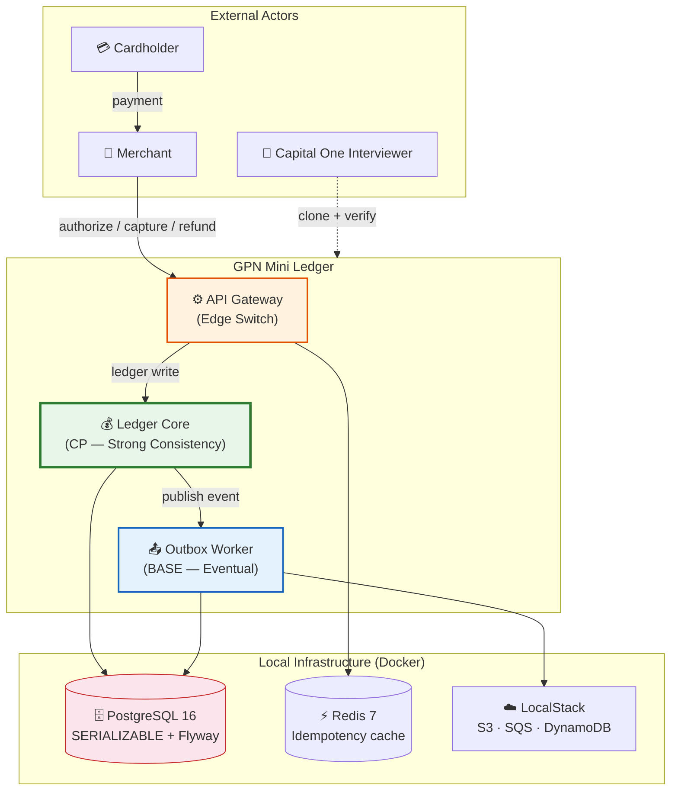
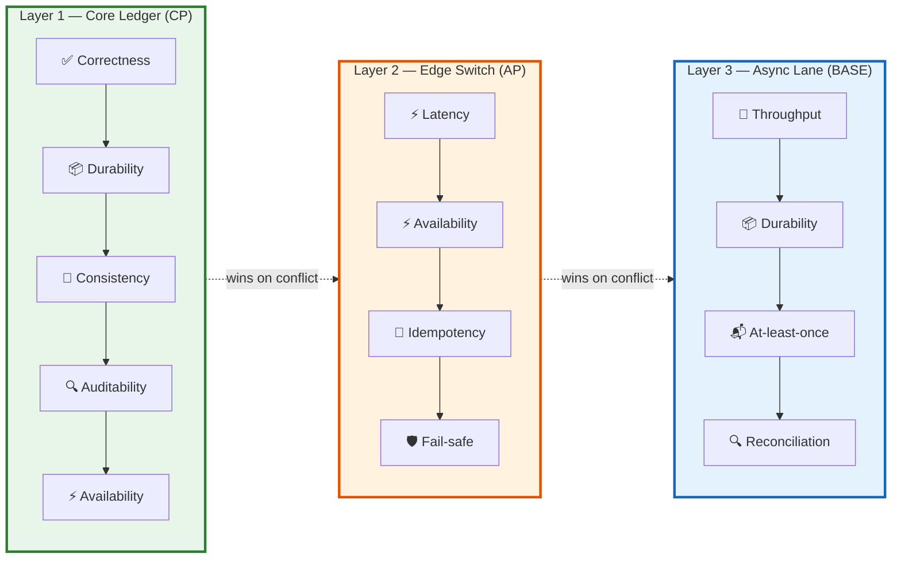
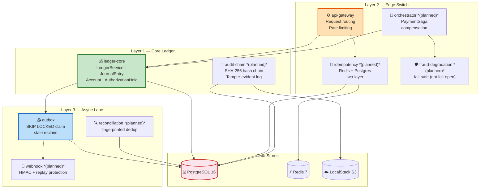
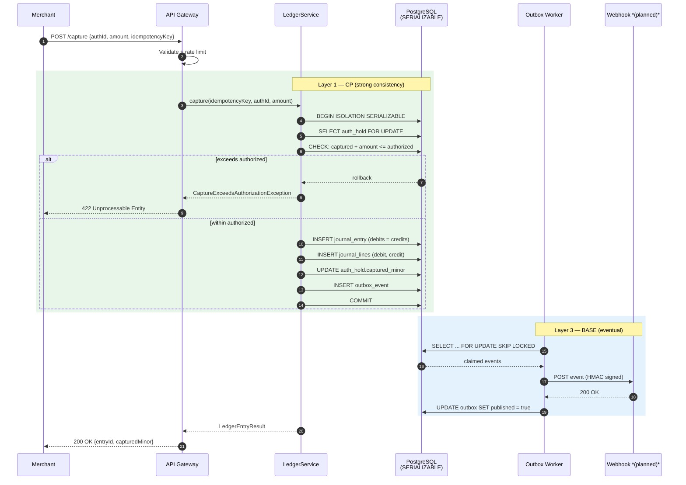
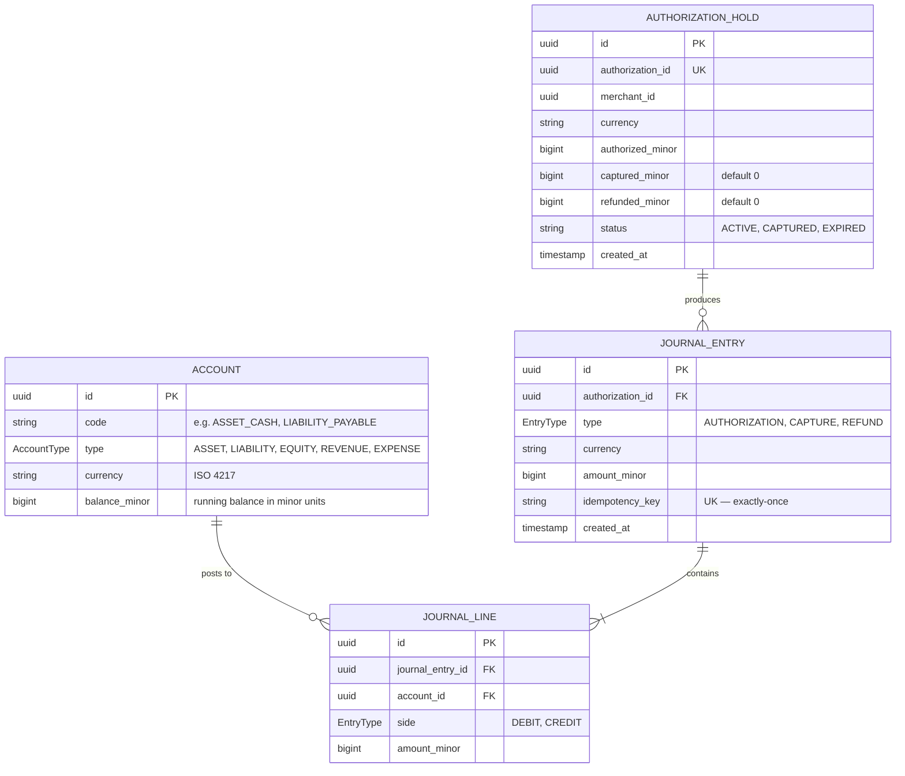
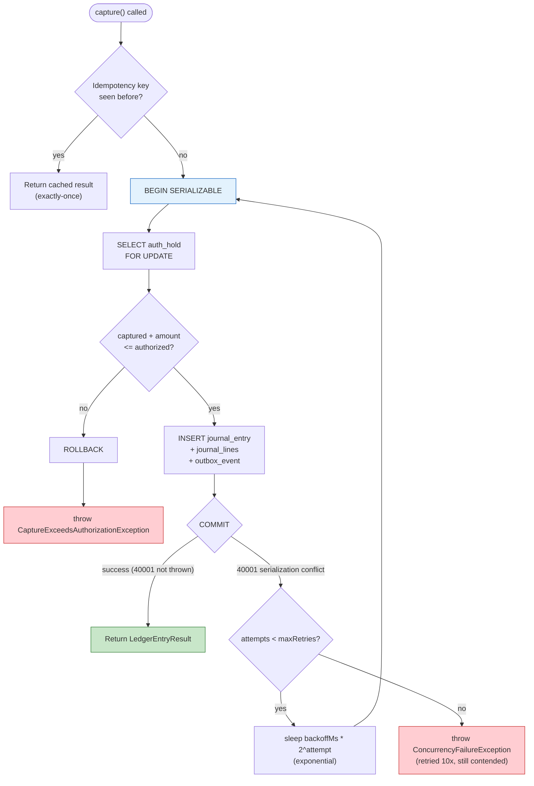
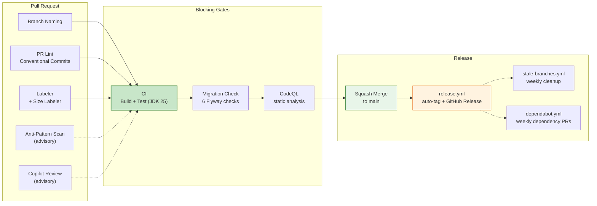

# GPN Mini Ledger

> A minimal **GPN-style payment system** demonstrating the layered priority stack
> (CP core ledger, AP edge switch, BASE async lane) with executable invariant tests.
> Runs 100% on local emulators — **zero cloud cost**, clone and verify in 10 minutes.

[](https://openjdk.org/)
[](https://spring.io/projects/spring-boot)
[](https://maven.apache.org/)
[](https://www.postgresql.org/)
[](https://github.com/sailikhithk/gpn-mini-ledger/actions/workflows/ci.yml)
[](https://github.com/sailikhithk/gpn-mini-ledger/actions/workflows/codeql.yml)
[](LICENSE)
[](#-invariant-tests)

---

## Table of Contents

- [What This Proves](#-what-this-proves)
- [Quick Start](#-quick-start)
- [Architecture](#-architecture)
  - [System Context](#system-context-diagram)
  - [The Layered Priority Stack](#the-layered-priority-stack)
  - [Module Map](#module-map)
  - [Request Flow — Capture](#request-flow--capture-sequence)
  - [Data Model](#data-model-erd)
  - [Concurrency — SERIALIZABLE + Retry](#concurrency--serializable--retry)
- [The 12 Production Patterns](#-the-12-production-patterns)
- [Invariant Tests](#-invariant-tests)
- [Tech Stack](#-tech-stack)
- [CI/CD Pipeline](#-cicd-pipeline)
- [Project Structure](#-project-structure)
- [Documentation](#-documentation)
- [Interview Citation](#-interview-citation)
- [License](#-license)

---

## What This Proves

| Signal | Evidence |
| --- | --- |
| Java 25 + Spring Boot 4.1 (current LTS) | `pom.xml`, matches Capital One stack |
| 12 production payment patterns | Each mapped to source file + line ref in [`docs/PRD.md`](docs/PRD.md) |
| 5 executable invariant tests | Graded proof levels: Domain, Persistence, Concurrency, Recovery |
| SERIALIZABLE isolation + retry-on-40001 | Proven under 20-thread contention (`ConcurrentCaptureInvariantTest`) |
| Double-entry ledger with balance invariant | `LED-001`: sum of debits = sum of credits, enforced in code |
| Zero cloud cost | PostgreSQL, Redis, Redpanda, LocalStack — all in Docker |

---

## Quick Start

```bash
# 1. Clone
git clone https://github.com/sailikhithk/gpn-mini-ledger.git
cd gpn-mini-ledger

# 2. Start infrastructure (PostgreSQL + LocalStack)
docker compose up -d

# 3. Build + run all invariant tests
./mvnw verify

# 4. (Optional) Start the ledger API
./mvnw -pl ledger-core spring-boot:run
```

> **Prerequisites**: Docker Desktop, Java 25 (or use the Maven wrapper — it downloads JDK 25 automatically).

---

## Architecture

### System Context Diagram



### The Layered Priority Stack

This is the core framework. Every module maps to exactly one layer. When priorities conflict, **the higher layer wins**.



**Conflict resolution examples:**
- **L1 vs L2**: Edge switch returns 503, but ledger never accepts an inconsistent write.
- **L2 vs L3**: Edge switch drops an event, but outbox never blocks the request path.
- **Within a layer**: Leftmost priority wins.

### Module Map



> **Status**: `ledger-core`, `api-gateway`, and `outbox` are implemented. Remaining modules are planned — see [`docs/PRD.md`](docs/PRD.md) for the full roadmap.

### Request Flow — Capture Sequence



### Data Model ERD



**Invariants enforced in code:**
- `LED-001`: For every `JournalEntry`, `SUM(debits) = SUM(credits)`
- `PAY-001`: `captured_minor + refunded_minor <= authorized_minor` (always)
- `IDEM-001`: `idempotency_key` is UNIQUE — exactly-once business effect

### Concurrency — SERIALIZABLE + Retry



**Tested by:** `ConcurrentCaptureInvariantTest` — 20 threads, 10 succeed, 10 rejected, zero "other errors", ledger balanced.

---

## The 12 Production Patterns

| # | Pattern | Layer | Status | Source |
| --- | --- | --- | --- | --- |
| 1 | Double-entry bookkeeping with balance invariant | L1 | ✅ | `LedgerService.java` |
| 2 | SERIALIZABLE isolation for all ledger writes | L1 | ✅ | `LedgerService.executeWithRetry` |
| 3 | Minor-unit `long` money (no float) | L1 | ✅ | `JournalLine.amount_minor` |
| 4 | Saga orchestration with compensation | L2 | 📋 planned | `PaymentOrchestrator` |
| 5 | Two-layer idempotency (Redis + Postgres) | L2 | 📋 planned | `IdempotencyService` |
| 6 | Transactional outbox with `SKIP LOCKED` claim | L3 | ✅ | `OutboxDispatchWorker` |
| 7 | Tamper-evident SHA-256 audit hash chain | L1 | 📋 planned | `AuditChainService` |
| 8 | Fail-safe fraud degradation (not fail-open) | L2 | 📋 planned | `FraudClient` |
| 9 | Stale outbox claim reclaim | L3 | 📋 planned | `OutboxDispatchWorker` |
| 10 | `REQUIRES_NEW` for idempotency store | L2 | 📋 planned | `IdempotencyService` |
| 11 | Webhook with HMAC + replay protection + DLQ | L3 | 📋 planned | `WebhookService` |
| 12 | Continuous reconciliation with fingerprinted dedup | L3 | 📋 planned | `ReconciliationService` |

> ✅ = implemented and tested · 📋 = planned (see [`docs/PRD.md`](docs/PRD.md) for design)

---

## Invariant Tests

These are the tests that make the repo stand out. Each is graded at a proof level following the `sentinel-ledger/INVARIANTS.md` framework.

| # | Test | Invariant | Proof Level | What It Proves |
| --- | --- | --- | --- | --- |
| 1 | 20-thread concurrent capture | `PAY-001`: capture ≤ authorized | **Concurrency** | SERIALIZABLE + balance invariant hold under contention |
| 2 | 100 same-key submits | `IDEM-001`: exactly-once | Persistence | Two-layer idempotency → one ledger entry |
| 3 | Outbox relay crash mid-batch | `OUT-002`: at-least-once, no lost events | **Recovery** | Stale claim reclaim picks up after worker crash |
| 4 | Audit chain tamper detection | `AUD-001`: tamper-evident log | Domain | `verifyChain()` returns `valid=false` after manual `UPDATE` |
| 5 | Reconciliation fingerprinted dedup | `REC-001`: no duplicate cases | Persistence | Re-run reconciliation → no second case |

```bash
# Run all invariant tests
./mvnw verify

# Run a single invariant test
./mvnw -pl ledger-core test -Dtest=ConcurrentCaptureInvariantTest
```

---

## Tech Stack

| Layer | Technology | Version | Why |
| --- | --- | --- | --- |
| Language | Java | 25 (LTS) | Current LTS, virtual threads mature |
| Framework | Spring Boot | 4.1 | Current, matches `sentinel-ledger` |
| Build | Maven | 3.9+ | Matches Capital One and Lilly DMS stack |
| Core DB | PostgreSQL | 16 | SERIALIZABLE isolation, advisory locks, `SKIP LOCKED` |
| Fast path | Redis | 7 | Idempotency cache, 72h TTL |
| Event bus | Redpanda | latest | Kafka-compatible, single-binary, no ZK |
| AWS local | LocalStack | latest | S3 (audit archive), SQS (webhook), DynamoDB |
| Migrations | Flyway | 10.x | Matches Lilly DMS, industry standard |
| Tests | JUnit 5 + Testcontainers | 1.20+ | Integration tests with real Postgres/Redis |
| HTTP client | Spring WebClient | 4.1 | Non-blocking, virtual-thread friendly |

---

## CI/CD Pipeline



**12 workflows active.** See [`.github/CI-CD.md`](.github/CI-CD.md) for the full pipeline reference and [`CONTRIBUTING.md`](CONTRIBUTING.md) for the development workflow.

---

## Project Structure

```
gpn-mini-ledger/
├── ledger-core/          # Layer 1 — Core ledger (CP, SERIALIZABLE)
│   ├── src/main/java/io/gpn/ledger/
│   │   ├── domain/       # JournalEntry, JournalLine, Account, AuthorizationHold
│   │   ├── service/      # LedgerService (executeWithRetry, SERIALIZABLE)
│   │   ├── repository/   # Spring Data JPA repositories
│   │   ├── web/          # REST controllers + request/response DTOs
│   │   └── config/       # LedgerProperties, ChartOfAccountsInitializer
│   └── src/test/java/    # Invariant tests (ConcurrentCapture, etc.)
├── api-gateway/          # Layer 2 — Edge switch (AP, idempotent)
├── outbox/               # Layer 3 — Transactional outbox (BASE)
├── infra/
│   ├── postgres/         # Flyway migrations
│   └── localstack/       # LocalStack S3/SQS/DynamoDB config
├── docs/                 # PRD, SRS, README index
├── .github/              # Workflows, CODEOWNERS, labeler, dependabot
├── docker-compose.yml    # PostgreSQL + LocalStack
└── pom.xml               # Parent POM (multi-module)
```

---

## Documentation

| Document | Purpose |
| --- | --- |
| [`docs/PRD.md`](docs/PRD.md) | Product Requirements — problem, goals, 12 patterns, 5 invariants |
| [`docs/SRS.md`](docs/SRS.md) | Software Requirements Specification |
| [`docs/README.md`](docs/README.md) | Documentation index |
| [`CHANGELOG.md`](CHANGELOG.md) | Versioned release history |
| [`LEARNINGS.md`](LEARNINGS.md) | Engineering learnings + design decisions |
| [`CONTRIBUTING.md`](CONTRIBUTING.md) | Development workflow, branching, commit format |
| [`.github/CI-CD.md`](.github/CI-CD.md) | CI/CD pipeline reference (12 workflows) |
| [`.github/SECURITY.md`](.github/SECURITY.md) | Vulnerability reporting process |

---

## Interview Citation

> *"I built a minimal version of this. It is on my GitHub at
> [github.com/sailikhithk/gpn-mini-ledger](https://github.com/sailikhithk/gpn-mini-ledger).
> The core ledger uses SERIALIZABLE isolation with a balance invariant test under
> 20-thread contention. The idempotency layer is two-tier, Redis fast path plus
> Postgres durable, with SHA-256 fingerprinting. The outbox uses `SKIP LOCKED` claim
> with stale claim reclaim. The audit log is a SHA-256 hash chain with PostgreSQL
> advisory locks. All 5 invariant tests pass. You can clone it and run
> `./mvnw verify` in 10 minutes."*

This is a different conversation than someone who only read about the patterns.

---

## License

[MIT](LICENSE) — see the [LICENSE](LICENSE) file for details.

---

<sub>Built by [Sai Likhith Kanuparthi](https://github.com/sailikhithk) as a citable reference for Capital One GPN system design interviews.</sub>
